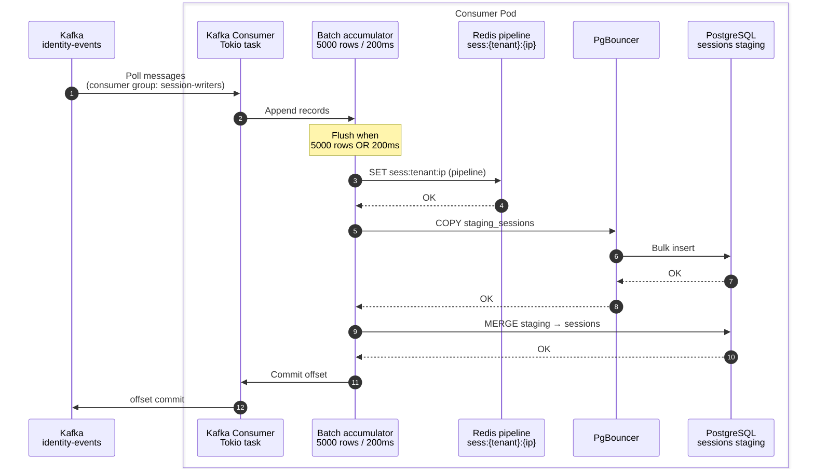

Contents


# Consumer Tier

The **consumer tier** reads from Kafka and writes to **SQL(Aurora)** and **Redis** (hot session index). It scales independently from the ingestion tier.

## Sequence diagram




## Consumer groups
```
    Topic           |   Initial Pods
    ----------------|--------------
`catalog-writers`   |   64
`identity-events`   |   16
```
* Max pods per topic ≈ partition count (128 session partitions → max ~128 useful session consumers).
* With **128 partitions** and **64 session pods**, each pod owns ~**2 partitions** on average.

Kafka rebalances on pod scale-up/down. Use **cooperative-sticky** assignor to minimize churn.


## Scaling
```
if (`kafka_consumer_group_lag` > 10K avg per pod for 5 min) {
    HPA scale up consumer deployment
}

// P99 means 99 out of 100 requests finish in expected time
if (PG `write_latency` p99 > 100 ms) {
    Increase batch size or add PgBouncer pool; do not add consumers blindly
}

if (Redis CPU > 70%)
{
    Scale ElastiCache shards
}
```