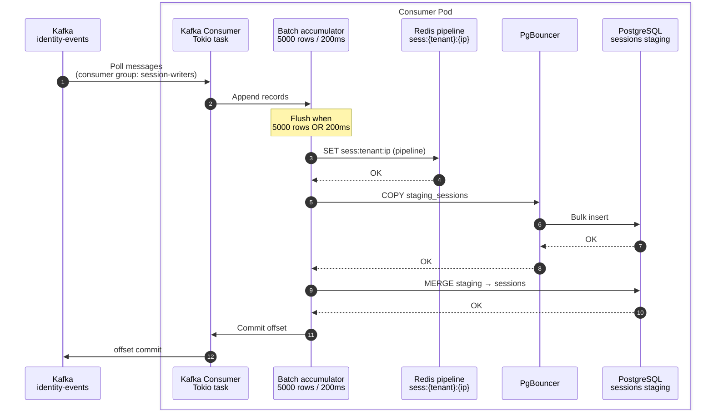

- [Consumer Tier](#consumer-tier)
- [Sequence diagram](#sequence-diagram)
- [Consumer groups](#consumer-groups)
- [Scaling](#scaling)
- [Kubernets](#kubernets)
  - [Initial pod counts](#initial-pod-counts)
  - [deployment.yaml](#deploymentyaml)

# Consumer Tier

The **consumer tier** reads from Kafka and writes to **SQL(Aurora)** and **Redis** (hot session index). It scales independently from the ingestion tier.

## Sequence diagram


## Consumer groups
```
    Topic           |   Initial Pods
    ----------------|--------------
`catalog-writers`   |   64
`identity-events`   |   16
```
* Max pods per topic ≈ partition count (128 session partitions → max ~128 useful session consumers).
* With **128 partitions** and **64 session pods**, each pod owns ~**2 partitions** on average.

Kafka rebalances on pod scale-up/down. Use **cooperative-sticky** assignor to minimize churn.


## Scaling
```
if (`kafka_consumer_group_lag(metric)` > 10K avg per pod for 5 min) {
    HPA scale up consumer deployment
}

// P99 means 99 out of 100 requests finish in expected time
if (PG `write_latency` p99 > 100 ms) {
    Increase batch size or add PgBouncer pool; do not add consumers blindly
}

if (Redis CPU > 70%)
{
    Scale ElastiCache shards
}
```

## Kubernets
### Initial pod counts

| Deployment | Consumer group | Initial replicas | HPA max | Partitions consumed |
|---|---|---|---|---|
| `server-consumer-session` | `session-writers` | **64** | **200** | `identity-events` (128) |
| `server-consumer-catalog` | `catalog-writers` | **16** | **48** | `identity-catalog` (32) |

**Start with 64 session + 16 catalog workers**; scale on **`kafka_consumer_group_lag`** custom metric.

Each session pod typically owns **2 partitions** at 128 partitions / 64 pods.

### deployment.yaml
```yaml
apiVersion: apps/v1
kind: Deployment
metadata:
  name: server-consumer-session
  namespace: identity-bridge
spec:
  replicas: 64
  selector:
    matchLabels:
      app: server-consumer-session
  template:
    metadata:
      labels:
        app: server-consumer-session
        tier: consumer
    spec:
      containers:
        - name: consumer
          image: identity-bridge/server-consumer-session:latest
          resources:
            requests:
              cpu: "4"
              memory: 8Gi
            limits:
              cpu: "8"
              memory: 16Gi
          env:
            - name: KAFKA_GROUP_ID
              value: session-writers
            - name: KAFKA_TOPIC
              value: identity-events
            - name: PG_POOL_URL
              valueFrom:
                secretKeyRef:
                  name: pgbouncer-credentials
                  key: url
            - name: REDIS_URL
              valueFrom:
                secretKeyRef:
                  name: redis-credentials
                  key: url
            - name: BATCH_MAX_ROWS
              value: "5000"
            - name: BATCH_MAX_MS
              value: "200"
---
apiVersion: autoscaling/v2
kind: HorizontalPodAutoscaler
metadata:
  name: server-consumer-session
spec:
  scaleTargetRef:
    apiVersion: apps/v1
    kind: Deployment
    name: server-consumer-session
  minReplicas: 32
  maxReplicas: 200
  metrics:
    - type: External
      external:
        metric:
          name: kafka_consumer_group_lag        <<<<<<<<
          selector:
            matchLabels:
              group: session-writers
        target:
          type: AverageValue
          averageValue: "10000"
```

[PgBouncer](https://code-with-amitk.github.io/System_Design/Concepts/Databases/SQL/PostgreSQL/pgBouncer.html) sits between all consumer pods and RDS primary — pool size tuned to **≤ 500** connections to RDS.