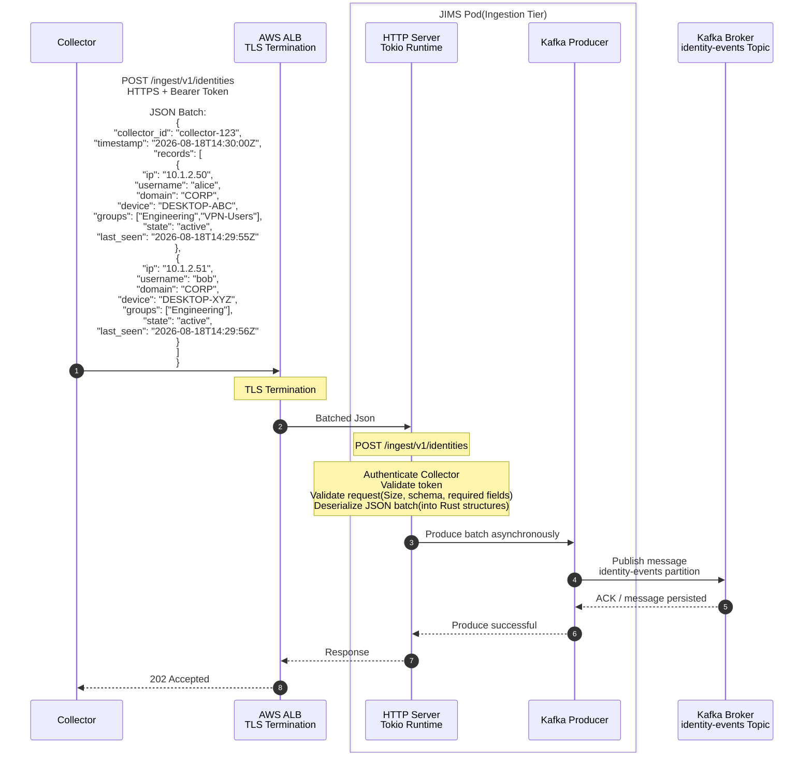

Ingestion Tier

- [Ingestion Tier](#ingestion-tier)
- [Duties](#duties)
  - [1. Authenticate Collector (mTLS or bearer API key scoped to `tenant_id`)](#1-authenticate-collector-mtls-or-bearer-api-key-scoped-to-tenant_id)
  - [2. Validate payload size, schema, required fields](#2-validate-payload-size-schema-required-fields)
  - [3. Deserialize JSON batch into internal envelope (Rust struct)](#3-deserialize-json-batch-into-internal-envelope-rust-struct)
  - [4. Assign Kafka message key](#4-assign-kafka-message-key)
  - [5. Produce to Kafka asynchronously (idempotent producer)](#5-produce-to-kafka-asynchronously-idempotent-producer)
  - [6. Return **202 Accepted** + `batch_id` after broker ACK (configurable: `acks=1` for speed, `acks=all` for durability)](#6-return-202-accepted--batch_id-after-broker-ack-configurable-acks1-for-speed-acksall-for-durability)
- [Kubernets](#kubernets)
  - [Capacity per pod](#capacity-per-pod)
  - [Deployment.yaml + HPA](#deploymentyaml--hpa)
- [Sequence Diagram](#sequence-diagram)


# Ingestion Tier

## Duties
### 1. Authenticate Collector (mTLS or bearer API key scoped to `tenant_id`)

### 2. Validate payload size, schema, required fields

- The ingestion layer validates every request **before** producing to Kafka. Invalid data is rejected with **4xx** so bad payloads never reach consumers or PostgreSQL.

| Check | Rule | Reject code |
|---|---|---|
| Payload size | Body ≤ configured max (e.g. **2 MB** uncompressed) | `413 Payload Too Large` |
| Content-Type | `application/json` (or `application/json` + gzip) | `415 Unsupported Media Type` |
| Schema | Required top-level fields present: `collector_id`, `timestamp`, `records` (array) | `400 Bad Request` |
| Record fields | Each session record must have `ip`, `username`, `domain`, `state`, `event_id` (UUID) | `400` with field path |
| Types | IP parseable, timestamps ISO-8601, `state` ∈ `{active, inactive}` | `400` |
| Tenant scope | `collector_id` in token must belong to authenticated `tenant_id` | `403 Forbidden` |

**Example — valid batch (abbreviated):**

```json
{
  "collector_id": "collector-mumbai-01",
  "timestamp": "2026-08-20T04:30:00Z",
  "records": [
    {
      "event_id": "a1b2c3d4-e5f6-7890-abcd-ef1234567890",
      "ip": "10.1.2.50",
      "username": "alice",
      "domain": "CORP",
      "groups": ["Engineering"],
      "state": "active",
      "last_seen": "2026-08-20T04:29:55Z"
    }
  ]
}
```

**Example — rejected:** missing `event_id` on a record, or `ip` = `"not-an-ip"` → **400** with `"records[0].ip: invalid IPv4/IPv6"`.

**Why it helps:** Kafka and consumers assume structurally valid messages. Early rejection saves broker disk, consumer CPU, and prevents poison messages that would retry indefinitely. Collectors get immediate feedback to fix configuration or bad event normalization.


### 3. Deserialize JSON batch into internal envelope (Rust struct)

- After validation, the HTTP handler parses JSON into a **Kafka envelope** — a Rust struct that wraps metadata plus typed records. This is what the Kafka producer serializes as the message **value** (the partition key is assigned separately in step 4).

```rust
pub struct IngestEnvelope {
    pub batch_id: Uuid,
    pub tenant_id: String,
    pub collector_id: String,
    pub received_at: DateTime<Utc>,
    pub record_type: IngestRecordType,  // Session | Catalog | Heartbeat
    pub records: Vec<SessionEvent>,     // or Vec<CatalogEvent>
}
```

**Example JSON envelope** (value written to topic `identity-events`):

```json
{
  "batch_id": "7f3e2a1b-4c5d-6e7f-8a9b-0c1d2e3f4a5b",
  "tenant_id": "tenant-acme-001",
  "collector_id": "collector-mumbai-01",
  "received_at": "2026-08-20T04:30:00.123Z",
  "record_type": "session",
  "records": [
    {
      "event_id": "a1b2c3d4-e5f6-7890-abcd-ef1234567890",
      "tenant_id": "tenant-acme-001",
      "event_type": "login",
      "domain": "CORP",
      "username": "alice",
      "ip_address": "10.1.2.50",
      "device": "DESKTOP-ABC",
      "logon_type": 3,
      "groups": ["Engineering", "VPN-Users"],
      "observed_at": "2026-08-20T04:29:55Z"
    }
  ]
}
```

- The envelope adds **`batch_id`** and **`received_at`** (server clock) for tracing and idempotency. 
- **`record_type`** routes to `identity-events` vs `identity-catalog`. Each `SessionEvent` maps to the existing `ib-common` type used by the consumer tier for bulk upsert.

### 4. Assign Kafka message key
### 5. Produce to Kafka asynchronously (idempotent producer)
### 6. Return **202 Accepted** + `batch_id` after broker ACK (configurable: `acks=1` for speed, `acks=all` for durability)

## Kubernets
### Capacity per pod
Based on Rust + Tokio + axum, ALB TLS offload, avg 16 KB body, async Kafka produce:
```
Req/sec per pod | CPU / memory per pod
        8,000   | 2 vCPU, 4 GiB 
12,000 – 15,000 | 4 vCPU, 8 GiB
         20,000 | 4 vCPU, 8 GiB
```
Planned Pods
```
| 1,500,000 ÷ 12,000 | **125 pods** |
| +25% headroom (rolling deploy, AZ loss) | **~160 pods** |
| HPA maximum (burst beyond 1.5M) | **300 pods** |
```
Configuration
```
| `replicas` (steady state) | **125** |
| HPA `minReplicas` | **50** |
| HPA `maxReplicas` | **300** |
| Scale metric | ALB `RequestCountPerTarget` + CPU > 60% |
```

### Deployment.yaml + HPA
```yaml
# Logical spec — apply via Helm/Kustomize in infra repo (later phase)
apiVersion: apps/v1
kind: Deployment
metadata:
  name: server-ingest
  namespace: identity-bridge
spec:
  replicas: 125
  selector:
    matchLabels:
      app: server-ingest
  template:
    metadata:
      labels:
        app: server-ingest
        tier: ingestion
    spec:
      affinity:
        podAntiAffinity:
          preferredDuringSchedulingIgnoredDuringExecution:
            - weight: 100
              podAffinityTerm:
                labelSelector:
                  matchLabels:
                    app: server-ingest
                topologyKey: topology.kubernetes.io/zone
      containers:
        - name: server-ingest
          image: identity-bridge/server-ingest:latest
          ports:
            - containerPort: 8080
          resources:
            requests:
              cpu: "2"
              memory: 4Gi
            limits:
              cpu: "4"
              memory: 8Gi
          env:
            - name: KAFKA_BROKERS
              valueFrom:
                configMapKeyRef:
                  name: kafka-config
                  key: brokers
            - name: RUST_LOG
              value: info
          livenessProbe:
            httpGet:
              path: /health/live
              port: 8080
          readinessProbe:
            httpGet:
              path: /health/ready
              port: 8080
---
apiVersion: autoscaling/v2
kind: HorizontalPodAutoscaler
metadata:
  name: server-ingest
spec:
  scaleTargetRef:
    apiVersion: apps/v1
    kind: Deployment
    name: server-ingest
  minReplicas: 50
  maxReplicas: 300
  metrics:
    - type: Resource
      resource:
        name: cpu
        target:
          type: Utilization
          averageUtilization: 60
```

## Sequence Diagram


