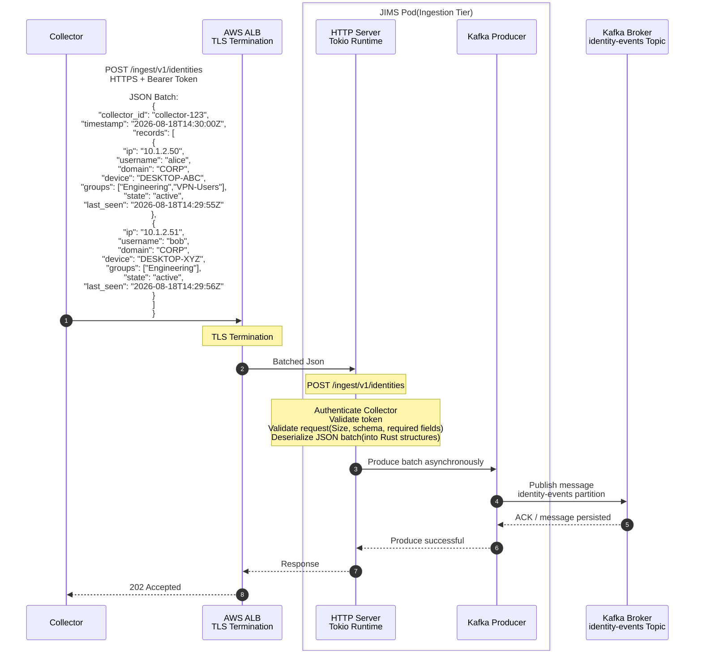

Ingestion Tier

- [Duties](#duties)
- [Kubernets](#kubernets)
  - [Capacity per pod](#capacity-per-pod)
  - [Deployment.yaml + HPA](#deploymentyaml--hpa)
- [Sequence Diagram](#sequence-diagram)


# Ingestion Tier

## Duties
1. Authenticate Collector (mTLS or bearer API key scoped to `tenant_id`)
2. Validate payload size, schema, required fields
3. Deserialize JSON batch into internal envelope (Rust struct)
4. Assign Kafka message key
5. Produce to Kafka asynchronously (idempotent producer)
6. Return **202 Accepted** + `batch_id` after broker ACK (configurable: `acks=1` for speed, `acks=all` for durability)

## Kubernets
### Capacity per pod
Based on Rust + Tokio + axum, ALB TLS offload, avg 16 KB body, async Kafka produce:
```
Req/sec per pod | CPU / memory per pod
        8,000   | 2 vCPU, 4 GiB 
12,000 – 15,000 | 4 vCPU, 8 GiB
         20,000 | 4 vCPU, 8 GiB
```
Planned Pods
```
| 1,500,000 ÷ 12,000 | **125 pods** |
| +25% headroom (rolling deploy, AZ loss) | **~160 pods** |
| HPA maximum (burst beyond 1.5M) | **300 pods** |
```
Configuration
```
| `replicas` (steady state) | **125** |
| HPA `minReplicas` | **50** |
| HPA `maxReplicas` | **300** |
| Scale metric | ALB `RequestCountPerTarget` + CPU > 60% |
```

### Deployment.yaml + HPA
```yaml
# Logical spec — apply via Helm/Kustomize in infra repo (later phase)
apiVersion: apps/v1
kind: Deployment
metadata:
  name: server-ingest
  namespace: identity-bridge
spec:
  replicas: 125
  selector:
    matchLabels:
      app: server-ingest
  template:
    metadata:
      labels:
        app: server-ingest
        tier: ingestion
    spec:
      affinity:
        podAntiAffinity:
          preferredDuringSchedulingIgnoredDuringExecution:
            - weight: 100
              podAffinityTerm:
                labelSelector:
                  matchLabels:
                    app: server-ingest
                topologyKey: topology.kubernetes.io/zone
      containers:
        - name: server-ingest
          image: identity-bridge/server-ingest:latest
          ports:
            - containerPort: 8080
          resources:
            requests:
              cpu: "2"
              memory: 4Gi
            limits:
              cpu: "4"
              memory: 8Gi
          env:
            - name: KAFKA_BROKERS
              valueFrom:
                configMapKeyRef:
                  name: kafka-config
                  key: brokers
            - name: RUST_LOG
              value: info
          livenessProbe:
            httpGet:
              path: /health/live
              port: 8080
          readinessProbe:
            httpGet:
              path: /health/ready
              port: 8080
---
apiVersion: autoscaling/v2
kind: HorizontalPodAutoscaler
metadata:
  name: server-ingest
spec:
  scaleTargetRef:
    apiVersion: apps/v1
    kind: Deployment
    name: server-ingest
  minReplicas: 50
  maxReplicas: 300
  metrics:
    - type: Resource
      resource:
        name: cpu
        target:
          type: Utilization
          averageUtilization: 60
```

## Sequence Diagram


