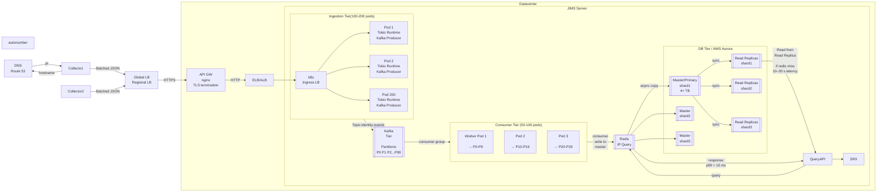

* Architecture
  * [Ingestion Tier](./Ingestion_Tier/README.md)
  * [Kafka Tier](./Kafka_Tier.md)
  * [Consumer Tier](./Consumer_Tier.md)
  * [DB Tier](./SQL_Tier.md)
  * [Redis Tier](./Redis_Tier.md)
  * [Metrics](./Metrics.md)
  * [Query Tier](./QueryAPI.md)
* [Architecture when ingest reaches 1.5M requests/sec](#architecture-when-ingest-reaches-15m-requestssec)

# Architecture
- Ingestion Tier(3..200 pods), Consumer Tier(3..50 pods) scaled independently
- Service to scale horizontally. The Rust API is stateless and Tokio-based
```
Ingestion Layer       Kafka              Consumer Layer
---------------     ---------            -------------
100 instances   →   100 partitions   →   50 workers   →   DB
```



---

## Architecture when ingest reaches 1.5M requests/sec

| Component | Role at 1.5M req/sec |
|---|---|
| **Ingestion tier** | ~125 pods (scale to 300); accept batches; produce to Kafka; **202 Accepted** |
| **Kafka (Amazon MSK(Managed Streaming for Kafka))** | Buffer; 128+ partitions on `identity-events` |
| **Consumer tier** | ~64+ session workers; bulk write PostgreSQL; update Redis |
| **Redis** | Hot session index for IP query |
| **PostgreSQL (Aurora)** | Durable store; primary for writes, replicas for Query |
| **Query tier** | Separate 20–50+ pods; **not** on the 1.5M ingest path |

Ingest QPS and firewall query QPS scale **independently**. A POP can run 1.5M ingest req/sec while Query tier serves thousands of SRX/vSRX with a smaller pod count.
