* Architecture
  * [Ingestion Tier](./Ingestion_Tier/README.md)
  * [Kafka Tier](./Kafka_Tier.md)
  * [Consumer Tier](./Consumer_Tier.md)
  * [DB Tier](./SQL_Tier.md)
  * [Redis Tier](./Redis_Tier.md)
  * [Metrics](./Metrics.md)
  * [Query Tier](./QueryAPI.md)
* [Architecture when ingest reaches 1.5M requests/sec](#architecture-when-ingest-reaches-15m-requestssec)

# Architecture
## Old
```
              |----------------- Server ------------|
			  |									    |
Collector-->  |rust  						   rust	----cache---->postgres
			  |task ---> |unbounded queue| --> task	|	  |			|
			  |										|	  |			|
			  |								rust   <------|---------|
			  |								task    |
			  |------------------------------/\-----|
											  |IP/user query
											  |
											  SRX firewall
```

![Architecture Diagram](https://www.plantuml.com/plantuml/png/bLJ1RkCs4BtpAmQvj4NXn9HRe0wAOgFi8atZfbhPG7hWXIjD7CBIK2MfROnYWPxw0UqVxfUKf1dPyIP6ejDmvhr7wd4uRwoJnlLjmngyTU0q6BMySr0hWvLJcfXTAUgaaIrqibh99SxTka48PKdB1Xdx2jxTEpGa6wXqssb2SfOD03WwrqtZLzhm8v0MplcJnMnJp7QBRw_dWahTEuJl9x7kCxk0YqP_yFlESW_3fT8K5n5vCSlP8otfP8Naq1p1NmpyjrCyAoxXuaOGBHNT2rhCvk21hI8PJ8Xw7d9niyzxDyjFpjA6ipnMzo6NDP9JRfqRLIyHvcW-Re-mZwKbsh0ZB1GQ-7eoucFeT6s_UJZ2bhVFNVrW1Na1WzO-U70rov-35xe6xlzKhvI6iYUdMXHq9MzN4WgZwxv24pKAVaWYUv54Tb1YF7wHoFKWycc8Xg2MJdwGraj6gg1We211XJHE1KkjZyTGS7-Qu-FZOZgDggk0_bBkKOEIxLiqJr_9ZJOhDFRvQza08DajwFC__q8n7XNJ3VsmkGE1UmPFb8DcJWPAvYbPeanUPbs9jGfDLC3x7iqwSat87JJeRRwnvWJERkPmrXjjvEQjvel1b_sjVfNMeJafZ6gbMGkoTzBKtg3lleL5djW7gOcI9In_2NYImDapu19b3ILsZQgaJHmUEMNv2agMAFmLd4dYPDkREcXwl20_3oBjlG-U0itBtsFTcdksaVmKnhNlQDfCTylEEOn6FuMn2gTmfwqZsIBpovZsrLEuB5Y2XPdg4xbqrHtMyClyjsjsdZrNyQbOYeFJ5tzUB8evYwkO3uoOP0aOfjLLYWk-3RDjUCs2G8pZo_KA2zsfofuAKcdGZl2Z3woWIZhPwEMmPf4IoUdPUdhryBoNHlSTOwaIKR7tTp22_ZJA8JWjg8sDnJQGQ67u7MdNL7byjtvKuOzM6MCU7EAoz9n0sIRuDlGu3_1nl62FZ8rpQtGhQBU7mfDNj-cqhR9M41z__lk_oHWiDD8XLMiM9NP_weyUpUufqnu6RQV9eY3efbFu4VWOMii6VcocDqXrtpR_0m00)

## New
### Ingest Pods
```
1 pod(12000 req/sec), 5 pods(60k), 10 pods(100k), 125 pods(1.5M)
```

### Consumer Pods
```
30-40 pods(identity partition), 8-16 pods(session consumer), 4-8(catalog consumer)
```



```mermaid
    flowchart LR
    autonumber
        DNS["DNS<br>Route 53"]
        C1["Collecto1"]
        C2["Collector2"]
        GLB["Global LB<br>Regional LB"]
        
        subgraph Datacenter
            APIGW["API GW<br/>nginx<br>TLS termination"]
            LB["ELB/ALB"]
            subgraph IdentityBridge Server
                subgraph API["Ingestion Tier(3-10 pods)"]
                    KLB["k8s<br>Ingress LB"]
                    P1["Pod 1<br/>Tokio Runtime<br> Kafka Producer"]
                    P2["Pod 2<br/>Tokio Runtime<br> Kafka Producer"]
                    PN["Pod 200<br/>Tokio Runtime<br> Kafka Producer"]
                end
                K[["Kafka<br>Tier<br><br> Partitions<br>P0 P1 P2...P99"]]
                subgraph Workers["Consumer Tier (3-10 pods)"]
                    W1["Worker Pod 1<br><br>→ P0-P9"]
                    W2["Pod 2<br><br>→ P10-P19"]
                    W3["Pod 3<br><br>→ P20-P29"]
                end
                redis[["Redis<br>IP Query"]]
                subgraph DBT["DB Tier / AWS Aurora"]
                    DB[["Master/Primary<br>shard1<br>4+ TB"]]
                    DB1[["Master<br>shard2"]]
                    DB2[["Master<br>shard3"]]
                    RR[["Read Replicas<br>shard1"]]
                    RR1[["Read Replicas<br>shard2"]]
                    RR2[["Read Replicas<br>shard3"]]
                end
                QAPI["QueryAPI"]
                srx["SRX"]
            end
        end

        C1 -->|hostname|DNS
        DNS -->|IP|C1

        C1 -->|Batched JSON| GLB
        C2 -->|Batched JSON| GLB
        GLB -->|HTTPS| APIGW
        APIGW -->|HTTP| LB
        LB --> KLB
        KLB --> P1
        KLB --> P2
        KLB --> PN

        API -->|Topic:identity-events| K
        K -->|consumer group| Workers

        Workers -->|consumer<br>write to<br>master| redis
        redis -->|async copy| DB
        redis --> DB1
        redis --> DB2
        
        DB -->|sync| RR
        DB -->|sync| RR1
        DB -->|sync| RR2

        RR -->|Read from<br>Read Replica<br><br>if redis miss<br>10–30 s latency| QAPI
        QAPI -->|query| redis
        redis -->|response<br> p99 < 10 ms| QAPI
        
        QAPI --> srx
```

---

## Old vs New

||Old|New|
|---|---|---|
|Design|1 process does ingest, buffering, DB writes, and firewall queries|jobs are split, bounded, and scaled independently|
|1sec Stall|~100k extra items in RAM||
|10sec Stall|1 million. Memory grows until the process dies.On crash, everything in that queue is gone — it is not on disk||
