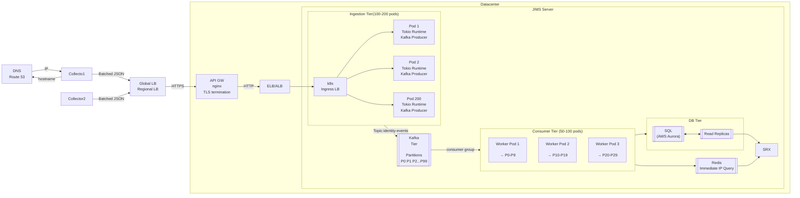

* Architecture
  * [Ingestion Tier](Ingestion_Tier.adoc)
  * [Kafka Tier](./Kafka_Tier.md)
  * [Consumer Tier](./Consumer_Tier.md)
  * [DB Tier](./SQL_Tier.md)
  * [Redis Tier](./Redis_Tier.md)
  * [Metrics](./Metrics.md)

# Architecture
- Ingestion Tier(3..200 pods), Consumer Tier(3..50 pods) scaled independently
- Service to scale horizontally. The Rust API is stateless and Tokio-based
```
Ingestion Layer       Kafka              Consumer Layer
---------------     ---------            -------------
100 instances   →   100 partitions   →   50 workers   →   DB
```


