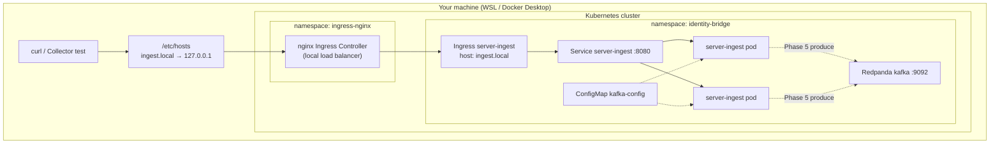

# Local testing — Docker Desktop Kubernetes or kind

Two deployment **phases** locally. **No AWS, no Aurora** for ingest→Kafka testing.

| Phase | Local contents |
|---|---|
| **Phase 0** | Kubernetes cluster, Redpanda Kafka, nginx Ingress Controller |
| **Phase 1** | Ingest ConfigMap, Deployment, Service, HPA, Ingress rules |

| Path | When to use |
|---|---|
| **[Docker Desktop Kubernetes](README-docker-desktop.md)** | Docker Desktop on Windows/Mac/WSL — **recommended if you already use Docker Desktop** |
| **[kind](README-kind.md)** | Standalone kind cluster in WSL (no Docker Desktop K8s) |

---

## Overall architecture (local)



**Flow:** HTTP → nginx Ingress (port 80) → Ingress rule → Service → Go ingest pods. Kafka is a separate pod in the same namespace. Ingest produces to Kafka after JSON validation.

---

## Quick commands

### Revert previous kind / local install

```bash
chmod +x deploy/local/revert-local.sh
./deploy/local/revert-local.sh
```

### Deploy on Docker Desktop Kubernetes

1. Docker Desktop → **Settings → Kubernetes → Enable Kubernetes** → Apply & Restart  
2. Wait until Kubernetes shows **Running** (green)

```bash
kubectl config use-context docker-desktop
cd ~/IdentityBridge
chmod +x deploy/local/deploy-docker-desktop.sh
./deploy/local/deploy-docker-desktop.sh
```

See [README-docker-desktop.md](README-docker-desktop.md) for command-by-command explanation.

### Deploy with kind (alternative)

```bash
./deploy/local/deploy.sh
```

See [README-kind.md](README-kind.md).

---

## Aurora / Redis

**Not required** for Phase 1–3 local testing. Only needed when you add consumer tier writing to PostgreSQL (later).
